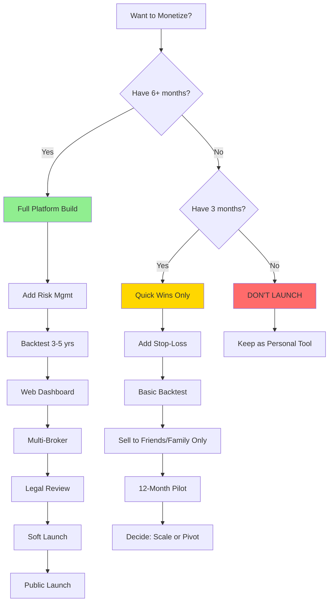

# 🎯 ARUN Trading Bot - Comprehensive Review & Monetization Strategy

> **Review conducted as:** Senior Software Architect + Senior Trading Specialist  
> **Date:** January 11, 2026  
> **Verdict:** ⚠️ **Good foundation, but needs significant work before monetization**

---

## 📊 Executive Summary

You've built an **RSI-based Indian stock trading bot** with a graphical interface that trades on the **mstock platform**. While the technical implementation shows promise, there are **critical gaps** in trading strategy sophistication, risk management, and user experience that must be addressed before this can be monetized to non-technical users.

### Warren Buffett's Perspective 🎩
*"Risk comes from not knowing what you're doing."* This bot currently operates on a single technical indicator (RSI) without fundamental analysis, position sizing rules, or portfolio-level risk controls. It's akin to driving with only one eye open.

---

## 🔍 What This Bot Does

### Core Functionality

#### 1. **Trading Strategy**
- **Type:** Mean Reversion Strategy using RSI (Relative Strength Index)
- **Logic:**
  - **BUY Signal:** When RSI drops below configured threshold (e.g., 35) → Stock is oversold
  - **SELL Signal:** When RSI exceeds configured threshold (e.g., 65) OR profit target hit (e.g., 10%)
  - **Timeframes:** Configurable (1min, 3min, 5min, 15min, 30min, 1hr, daily)

#### 2. **Automation Capabilities**
- ✅ Fetches live market data from mstock API
- ✅ Calculates real-time RSI using TradingView's methodology
- ✅ Monitors positions and executes buy/sell orders automatically
- ✅ Tracks profit/loss for each position
- ✅ Handles session management and token refresh
- ✅ Offline detection and graceful degradation
- ✅ Market hours awareness (9:15 AM - 3:30 PM IST, weekdays only)

#### 3. **User Interface**
- **Desktop Application** built with CustomTkinter (modern dark theme)
- **Features:**
  - Start/Stop bot control
  - Live positions dashboard with P&L tracking
  - RSI monitor showing real-time indicators for all tracked symbols
  - Activity log for transparency
  - Color-coded profit/loss display

#### 4. **Configuration System**
- CSV-based configuration ([config_table.csv](file:///c:/Users/user/OneDrive/Documents/STock%20Trading/Arun-BOTProject/LiveBot%20Code/config_table.csv))
- Per-symbol customization:
  - Buy/Sell RSI thresholds
  - Profit targets
  - Quantity allocations
  - Timeframe selection
  - Exchange preference (NSE/BSE)

---

## 📖 How to Use This Bot

### Prerequisites
1. **mstock Demat Account** with API access
2. **API Credentials** (API Key, Secret, Client Code, Password)
3. **Windows PC** (executable is `.exe`)

### Setup Steps

1. **Configure Environment**
   - Create a `.env` file with your mstock credentials:
     ```
     API_KEY=your_api_key
     API_SECRET=your_secret
     CLIENT_CODE=your_client_code
     PASSWORD=your_password
     ```

2. **Edit Trading Rules**
   - Open `config_table.csv`
   - Add stocks you want to trade:
     - `Symbol`: Stock symbol (e.g., MICEL, MOSCHIP)
     - `Enabled`: TRUE/FALSE
     - `Timeframe`: 15T (15 minutes), 5T (5 minutes), etc.
     - `Buy RSI`: Oversold threshold (e.g., 35)
     - `Sell RSI`: Overbought threshold (e.g., 65)
     - `Profit Target %`: Target profit (e.g., 10)
     - `Quantity`: Number of shares to trade (0 for auto)
     - `Exchange`: NSE or BSE

3. **Launch the Bot**
   - Run `kickstart_gui.exe` from the `dist` folder
   - Click **"▶ Start Bot"**
   - Monitor the dashboard for trades and RSI values

4. **Monitoring**
   - **Live Positions:** Shows your active trades with entry price, current price, and P&L
   - **RSI Monitor:** Real-time RSI values color-coded by signal strength
   - **Activity Log:** All actions logged in the text area

### Current Stock Configuration
Based on your `config_table.csv`:
- **MICEL** (BSE) - 15min timeframe, RSI 35/65, 10% profit target
- **MOSCHIP** (NSE & BSE) - Same parameters

---

## ⚠️ Critical Issues & Areas for Improvement

### 🚨 **CRITICAL: Trading Strategy Weaknesses**

#### 1. **Single-Indicator Dependency**
**Problem:** Relying solely on RSI is dangerous.

**Why it matters:**
- RSI can stay oversold/overbought for extended periods in trending markets
- No confirmation from other indicators (volume, price action, trend)
- High false signal rate in choppy markets

**Warren Buffett says:** *"Never depend on a single opinion."* 

**Fix:**
- ✅ Add **volume confirmation** (ensure high volume on RSI extremes)
- ✅ Implement **trend filters** (SMA/EMA crossovers)
- ✅ Add **support/resistance levels** awareness
- ✅ Include **volatility filters** (ATR) to avoid whipsaws

#### 2. **No Risk Management**
**Problem:** The bot has **ZERO risk controls.**

**Missing safeguards:**
- ❌ No stop-loss mechanism (only profit target)
- ❌ No position sizing based on volatility/risk
- ❌ No portfolio-level exposure limits
- ❌ No maximum drawdown circuit breaker
- ❌ No trade frequency limits

**Warren Buffett says:** *"Rule No. 1: Never lose money. Rule No. 2: Never forget rule No. 1."*

**Fix:**
```python
# Example additions needed:
MAX_POSITION_SIZE = 0.05  # 5% of portfolio per stock
MAX_PORTFOLIO_RISK = 0.20  # 20% total exposure
STOP_LOSS_PCT = 0.05  # 5% stop loss
MAX_DAILY_TRADES = 10
DAILY_LOSS_LIMIT = 0.03  # 3% of capital
```

#### 3. **No Backtesting Evidence**
**Problem:** You're trading real money without historical validation.

**Impact:**
- Unknown win rate
- Unknown average profit/loss per trade
- Unknown maximum drawdown
- Unknown strategy longevity

**Fix:**
- ✅ Implement backtesting engine using historical data
- ✅ Calculate key metrics: Sharpe ratio, win rate, max drawdown, profit factor
- ✅ Paper trade for 3-6 months before going live

#### 4. **Quantity Management Issues**
**Problem:** Config shows `Quantity=0` for all stocks.

**Questions:**
- How is position size determined?
- Is this using available capital limits correctly?
- What happens with partial fills?

**Fix:** Implement clear position sizing logic (e.g., Kelly Criterion, fixed fractional).

---

### 🔧 **MAJOR: Technical Improvements Needed**

#### 1. **Error Handling & Resilience**
**Current State:** Good offline detection, but:
- ❌ No handling of partial order fills
- ❌ No order rejection recovery
- ❌ Limited API rate limit handling
- ❌ No database for trade history persistence

**Fix:**
- Implement SQLite database for trade logging
- Add retry logic with exponential backoff
- Handle corner cases (market halts, circuit breakers)

#### 2. **Performance & Scalability**
**Concerns:**
- Synchronous API calls can slow down during high-frequency monitoring
- GUI updates every 2 seconds might cause UI lag
- No caching strategy for repeated data fetches

**Fix:**
- Implement async/await for API calls
- Add data caching with TTL
- Optimize GUI update frequency

#### 3. **Security**
**Vulnerabilities:**
- ✅ Good: Using `.env` for credentials
- ⚠️ Concern: `credentials.json` stores access tokens in plaintext
- ❌ Missing: No encryption for sensitive data

**Fix:**
- Encrypt credential files
- Use Windows Credential Manager or keyring library
- Add 2FA support if mstock offers it

---

### 📊 **Data & Analytics Gaps**

#### Missing Features for Serious Trading:
1. **Performance Analytics**
   - No trade journal/history
   - No daily/weekly/monthly P&L reports
   - No equity curve visualization
   - No trade statistics (win rate, avg hold time, etc.)

2. **Market Context**
   - No NIFTY/SENSEX trend awareness
   - No sector rotation analysis
   - No correlation monitoring
   - No news/event awareness

3. **Alerts & Notifications**
   - No Telegram/WhatsApp alerts for trades
   - No email reports
   - No critical error notifications

---

## 💰 Monetization Strategy for Non-Technical Users

### 🎯 Value Proposition (What to Sell)

You're **NOT selling a trading bot** — you're selling:
1. **"Automated Trading Assistant"** that works 24/7 during market hours
2. **"Set-and-Forget Trading"** for busy professionals
3. **"Disciplined Execution"** — removes emotional decision-making

### Target Audience Segmentation

#### Tier 1: **Hobbyist Traders**
- **Profile:** Salaried individuals, ₹5-20 lakh capital
- **Pain Point:** "I don't have time to watch the market all day"
- **Pricing:** ₹2,999 - ₹4,999/month or ₹29,999/year

#### Tier 2: **Serious Retail Traders**
- **Profile:** Active traders, ₹20 lakh - ₹1 crore capital
- **Pain Point:** "I need systematic execution without emotion"
- **Pricing:** ₹9,999/month or ₹99,999/year

#### Tier 3: **Professional/HNI**
- **Profile:** High-net-worth, ₹1 crore+ capital
- **Pain Point:** "I want institutional-grade automation"
- **Pricing:** ₹25,000/month + performance fee (10-20% of profits)

---

### 🚀 Product Roadmap to Monetization

#### **Phase 1: Foundation (3-6 months) — DO NOT SKIP**

> [!CAUTION]
> **Launching without completing Phase 1 is unethical and potentially illegal.**

**MUST-HAVE Features:**
1. ✅ **Multi-Strategy Support**
   - Add momentum, breakout, and trend-following strategies
   - Let users combine strategies with weighting

2. ✅ **Robust Risk Management**
   - Stop-loss automation
   - Position sizing algorithms
   - Portfolio-level risk limits
   - Daily loss circuit breakers

3. ✅ **Comprehensive Backtesting**
   - Prove strategy works on 3-5 years of data
   - Show audited results with realistic slippage/commissions
   - Publish monthly performance reports

4. ✅ **Trade Journaling**
   - SQLite database for all trades
   - Export to Excel/PDF
   - Performance analytics dashboard

5. ✅ **Security & Compliance**
   - Encrypt credentials
   - HTTPS for all communications
   - Data privacy compliance (GDPR if applicable)
   - **Legal disclaimer:** "Algorithm trading involves risk. Past performance ≠ future results."

6. ✅ **Broker Diversification**
   - Support Zerodha, Upstox, Angel One (not just mstock)
   - Use standard broker APIs (e.g., Kite Connect)

---

#### **Phase 2: User Experience (2-3 months)**

Make it **foolproof for non-techies:**

1. ✅ **Web Dashboard (Instead of Desktop App)**
   - Build with Streamlit, Dash, or React
   - Cloud-hosted (AWS/DigitalOcean)
   - Mobile-responsive design

2. ✅ **One-Click Setup**
   - Guided onboarding wizard
   - Pre-configured conservative strategies
   - Video tutorials embedded

3. ✅ **Simplified Configuration**
   - Replace CSV with visual forms
   - Strategy templates: "Conservative," "Moderate," "Aggressive"
   - Real-time validation/warnings

4. ✅ **Notifications**
   - Telegram/WhatsApp for trade alerts
   - Daily/weekly email summaries
   - SMS for critical errors

5. ✅ **Customer Support**
   - In-app chat
   - FAQ/Knowledge base
   - Phone support for Tier 2/3 customers

---

#### **Phase 3: Monetization Infrastructure (1-2 months)**

1. ✅ **Subscription Management**
   - Integrate Razorpay/Stripe for payments
   - Monthly/annual subscriptions
   - Trial period (7-14 days paper trading)

2. ✅ **License Management**
   - Unique license keys per user
   - Hardware ID binding (prevent sharing)
   - Auto-renewal handling

3. ✅ **Analytics & Attribution**
   - Google Analytics / Mixpanel
   - Track user journey
   - Conversion funnel optimization

4. ✅ **Compliance**
   - Terms of Service (drafted by lawyer)
   - Privacy Policy
   - Risk disclosure forms (mandatory)
   - SEBI compliance check (consult advisor)

---

#### **Phase 4: Growth & Scale (Ongoing)**

1. ✅ **Content Marketing**
   - Blog: "How RSI Trading Works," "Common Mistakes," etc.
   - YouTube: Strategy explainers, live trading sessions
   - Case studies of successful users (with permission)

2. ✅ **Community Building**
   - Discord/Telegram group for users
   - Monthly webinars
   - Strategy sharing marketplace

3. ✅ **Partnerships**
   - Affiliate with financial YouTubers/influencers
   - Bundle with brokers (e.g., "Free bot with Zerodha account")
   - Collaborate with trading educators

4. ✅ **Advanced Features (Upsell)**
   - AI-powered strategy optimization
   - Multi-asset (stocks + F&O + crypto)
   - Custom strategy builder (no-code)
   - Copy trading (follow top performers)

---

### 💵 Revenue Model Comparison

| Model | Pros | Cons | Best For |
|-------|------|------|----------|
| **Flat Subscription** | Predictable, easy to sell | Leaves money on table for big winners | Hobbyists |
| **Tiered Pricing** | Captures different segments | Complex to manage | Most users |
| **Performance Fee** | Aligns incentives | Hard to calculate, trust issues | HNIs |
| **Freemium** | Viral growth | Low conversion (<5%) | Early traction |
| **One-Time License** | Big upfront cash | No recurring revenue | Legacy model (avoid) |

**Recommended:** **Tiered Subscription + Performance Fee for Tier 3**

---

## 🎓 Making It Non-Techie Friendly

### Key Principles:

#### 1. **Hide Complexity**
- ❌ Don't show: RSI formulas, API endpoints, error logs
- ✅ Show: "Bot is finding opportunities," "2 trades today, +₹3,450 profit"

#### 2. **Visual Explanations**
- Use charts to show RSI in action
- Before/after screenshots of account growth
- Video onboarding: "Your first automated trade in 5 minutes"

#### 3. **Safety First**
- Default to conservative settings
- Big red warnings for aggressive strategies
- Paper trading mode mandatory for first week

#### 4. **Education Embedded**
- Tooltips explaining every term
- Pop-up: "What is RSI?" with simple analogy
- Gradual feature unlocking (gamification)

#### 5. **White-Glove Service (Premium Tiers)**
- 1-on-1 onboarding call
- Custom strategy design
- Monthly review calls

---

## 🏆 Competitive Differentiation

### How to Stand Out:

1. **Transparency**
   - Publish all strategy logic openly
   - Show live trades (with user permission)
   - Monthly audited performance reports

2. **India-Specific**
   - Optimized for NSE/BSE market hours
   - INR-denominated backtests
   - Support local brokers (not just Zerodha)

3. **Hybrid Approach**
   - Combine algo trading with fundamental filters
   - "Warren Buffett's quality checklist + RSI timing"

4. **Community-Driven**
   - Let users share & rate strategies
   - Leaderboard of top performers
   - Open-source core (freemium model)

---

## 📋 Honest Assessment Summary

### Strengths ✅
- Clean, modular code architecture
- Solid offline/error handling framework
- Modern GUI with good UX basics
- Multi-exchange support (NSE/BSE)
- Timeframe flexibility

### Weaknesses ❌
- **Single indicator** (RSI only) = high risk
- **No stop-loss** = catastrophic drawdown potential
- **No backtesting** = unproven strategy
- **Desktop-only** = limits market reach
- **Single broker** (mstock) = vendor lock-in
- **No audit trail** = can't learn from mistakes

### Blocker Issues (Must Fix Before Launch) 🚨
1. Add comprehensive risk management
2. Implement and publish backtested results
3. Add multi-indicator confirmation
4. Create web-based interface
5. Support major brokers (Zerodha, Upstox)
6. Get legal review of terms & compliance

---

## 🎯 Final Recommendation

### As an Architect:
This bot has a **solid MVP foundation** but needs 4-6 months of hardening before it's production-ready for paying customers. The code quality is good, but the **strategy logic is too simplistic** for real money.

### As a Trading Specialist (Warren Buffett Mode):
> *"I would not trade my own money with this bot in its current state."*

**Why?** It's missing:
- Margin of safety (stop-loss)
- Diversification (multi-strategy)
- Proven edge (backtest results)

**But:** With proper risk controls and validation, the **RSI mean-reversion approach can work** in range-bound markets (which India sees often).

---

## 🚦 Go/No-Go Decision Tree



---

## 💡 Next Steps (Prioritized)

### Immediate (This Week)
1. **Add stop-loss logic** to `kickstart.py`
2. **Create SQLite trade journal** for logging
3. **Set up paper trading mode** (simulated orders)

### Short-Term (1 Month)
4. **Backtest using 2-year NSE data** (prove it works)
5. **Add volume filter** to RSI signals
6. **Build simple web dashboard** (Streamlit prototype)

### Medium-Term (3 Months)
7. **Integrate Zerodha Kite Connect** API
8. **Add Telegram notifications**
9. **Create sales landing page** with demo video
10. **Get legal consultation** on compliance

### Long-Term (6 Months)
11. **Launch beta with 10-20 pilot users**
12. **Build payment/subscription system**
13. **Create video course** on strategy logic
14. **Hire support staff** (if scale demands)

---

## 📞 Recommended Expert Consultations

1. **SEBI Compliance Lawyer** (₹15-25k)
   - Ensure you're not violating securities law
   - Draft watertight terms of service

2. **CA/Tax Advisor** (₹10-15k)
   - GST registration for SaaS sales
   - Tax implications of performance fees

3. **Algo Trading Veteran** (₹25-50k consulting)
   - Review strategy logic
   - Suggest institutional-grade improvements

4. **UX Designer** (₹30-50k)
   - Redesign for non-techies
   - Conduct user testing

**Total Investment Before Launch: ~₹1-1.5 lakh**

---

## 🎬 Closing Thoughts

You've built something genuinely useful — **a disciplined trading executor**. But remember:

> *"The stock market is a device for transferring money from the impatient to the patient."* — Warren Buffett

Your bot serves the **impatient** (day traders). To monetize successfully, you must:
1. **Protect them from themselves** (risk controls)
2. **Prove your edge** (backtests, live track record)
3. **Simplify to the extreme** (your grandmother should understand it)

**Good luck! You're 40% there. Don't rush the remaining 60%.** 🚀

---

**Questions? Let's dive deeper into any section.**
