# 📊 ARUN Trading Bot - Strategy & Conditions Analysis

## Overview
This bot implements an **RSI-based mean reversion strategy** for Indian stock markets (NSE/BSE). It's a relatively simple, indicator-driven approach that buys oversold stocks and sells when they're overbought or hit a profit target.

---

## 🎯 Trading Strategy Summary

**Strategy Type**: RSI Mean Reversion + Profit Target  
**Market**: Indian Stocks (NSE & BSE)  
**Timeframe**: Configurable (15-minute default)  
**Primary Indicator**: RSI (14-period, TradingView calculation method)

---

## 📈 BUY CONDITIONS

The bot will place a **BUY order** when **ALL** of the following conditions are met:

### 1. RSI Threshold
```
Current RSI ≤ Buy RSI Threshold (default: 35)
```
- The bot waits for the stock to become "oversold"
- Lower RSI = more oversold = potential bounce opportunity

### 2. Market Hours
```
Market is OPEN (Monday-Friday, 09:15 - 15:30 IST)
```
- No after-hours or weekend trading
- Market open check: `is_market_open_now_ist()`

### 3. No Existing Position
```
Available Quantity for (Symbol, Exchange) = 0
WHERE Available Quantity = Total Quantity - Used Quantity
```
- The bot checks `safe_get_live_positions_merged()` before buying
- **Critical Logic**: Will NOT buy if there's already a position in that symbol+exchange pair
- **Used Quantity Tracking**: Accounts for shares tied up in pending SELL orders
- Prevents averaging down or adding to positions

### 4. No Pending Orders
```
No OPEN/PENDING/TRIGGERED/TRADED orders blocking the same side
Blocking statuses: {"OPEN", "PENDING", "TRIGGERED", "TRADED"}
```
- Checked via `check_existing_orders(symbol, exchange, qty, "BUY")`
- **Special Logic**: If both BUY and SELL orders exist, allows BUY only if quantities match exactly
  - Example: If you have a pending SELL of 10 shares AND a pending BUY of 10 shares, bot allows another BUY
  - Rationale: Paired orders indicate square-off, not blocking condition
- Prevents duplicate buy orders and order pileups

### 5. System Online
```
Internet connectivity is available
```
- Offline detection prevents API errors

---

## 💰 SELL CONDITIONS

The bot will place a **SELL order** when **ANY** of the following conditions are met:

### Condition A: RSI Overbought + Profitable
```
(Current RSI ≥ Sell RSI Threshold) AND (Current Price > Entry Price)
```
- **Sell RSI default**: 65 (overbought territory)
- **Profit requirement**: Current price must be above entry price
- This prevents selling at a loss just because RSI is high

### Condition B: Profit Target Hit
```
Current Price ≥ Target Price
WHERE Target Price = Entry Price × (1 + Profit Target %)
```
- **Default Profit Target**: 10%
- **Example**: If entry = ₹100, target = ₹110
- This is a **hard stop** - bot will sell regardless of RSI

### Additional Sell Requirements:
- Market must be OPEN
- Bot must have an active position (`pos["active"] = True`)
- Entry price must be valid (`pos["price"] > 0`)
- Available quantity must be > 0

---

## ⚙️ Current Configuration

Based on `config_table.csv`:

| Symbol  | Exchange | Timeframe | Buy RSI | Sell RSI | Profit Target | Quantity |
|---------|----------|-----------|---------|----------|---------------|----------|
| MICEL   | BSE      | 15T       | 35      | 65       | 10%           | Dynamic* |
| MOSCHIP | NSE      | 15T       | 35      | 65       | 10%           | Dynamic* |
| MOSCHIP | BSE      | 15T       | 35      | 65       | 10%           | Dynamic* |

*Quantity is set to 0 in config, which might cause issues - needs verification

---

## 🔍 Technical Implementation Details

### RSI Calculation
- **Method**: TradingView-exact RMA (Relative Moving Average)
- **Period**: 14 bars
- **Data Source**: Yahoo Finance via `yfinance`
- **Live Price Integration**: Last bar updated with current LTP from broker
- **Session Filter**: Only 09:15-15:30 IST candles (matches TradingView NSE session)

### Order Execution
- **Order Type**: MARKET orders (price = 0)
- **Product Type**: CNC (Cash & Carry / Delivery)
- **Validity**: DAY orders
- **Broker**: Mirae Asset (mstock API)
- **Order Variety**: Regular (not AMO/cover/bracket)
- **Order Validity**: DAY (expires at market close if unfilled)

### Position Tracking
The bot uses a **sophisticated 3-source merge** via `safe_get_live_positions_merged()`:

1. **Holdings API** (`/portfolio/holdings`): Long-term positions from broker portfolio
2. **Today's Orders API** (`/orders`): All executed orders from today (COMPLETE/EXECUTED/FILLED status)
3. **Merged Live Position**: Real-time calculation combining both sources

#### How the Merge Works:
- **Step 1**: Fetch holdings from broker (existing positions)
- **Step 2**: Fetch today's executed orders (BUY/SELL)
- **Step 3**: Calculate net position:
  - Start with holdings quantity
  - Add today's BUY quantities
  - Subtract today's SELL quantities
  - Result = Accurate available quantity

**Why this matters**: Prevents race conditions where you place an order but the holdings API hasn't updated yet. The bot sees the order execution immediately and adjusts position tracking accordingly.

---

## ⚠️ Critical Observations & Potential Issues

### 1. **Quantity = 0 in Config**
```csv
Quantity,0
```
> **Issue**: All symbols have Quantity=0, which will result in 0-share orders
> **Impact**: No actual trades will execute
> **Fix Needed**: Update config with actual share quantities

### 2. **No Stop Loss**
- Bot only sells on profit (RSI + profit check)
- If a stock crashes, bot will hold indefinitely
- **Risk**: Unlimited downside exposure

### 3. **No Position Sizing Logic**
- Fixed quantity per symbol (once configured)
- No risk-based position sizing (e.g., % of portfolio)
- No maximum capital allocation

### 4. **Duplicate Symbol (MOSCHIP)**
- Configured for both NSE and BSE
- Could lead to double exposure to same company
- Different exchanges may have liquidity issues

### 5. **RSI Mean Reversion Limitations**
- Works best in ranging/choppy markets
- Can fail in strong trends (buy the dip → keeps dipping)
- 15-minute timeframe = intraday noise

### 6. **No Volatility Filters**
- Doesn't check ATR, Bollinger Bands, or market regime
- Equal treatment of low-vol and high-vol stocks

### 7. **Single Indicator Dependency**
- Entire strategy relies on RSI alone
- No volume confirmation
- No trend filters (moving averages, etc.)

### 8. **Execution Logic Gap**
```python
if last_rsi <= buy_rsi and is_market_open_now_ist() and not check_existing_orders(...):
    need_qty = qty - max(0, available_qty)
```
If `qty=0`, then `need_qty = 0 - 0 = 0` → no order placed

### 9. **No Concurrency Protection for Same Symbol**
- Bot uses `SYMBOL_LOCKS` dictionary (lines 713-802)
- Only ONE processing cycle can run per symbol at a time
- **Risk**: If lock fails, concurrent cycles could place duplicate orders
- Current implementation: Basic boolean lock (not thread-safe)

### 10. **Offline Mode Behavior**
- When internet connection lost, bot enters "offline mode"
- **ALL trading operations paused**: No orders, no data fetching
- Connectivity monitor checks Google.com every 5 seconds
- Once back online, resumes normal operation
- **Gap**: No order reconciliation after reconnection (could miss fills)

### 11. **Market Data Caching**
- Bot caches market quotes per trading cycle
- Cache key: `{exchange}:{symbol}`
- **Purpose**: Avoid fetching same symbol data multiple times in one cycle
- **Limitation**: If cycle takes >1 minute, cached data could be stale
- Cache resets at start of each `run_cycle()`

### 12. **⚠️ NO Funds/Margin Checking**
- Bot does **NOT** check available balance before placing orders
- **Risk**: Order will be sent to broker and rejected if insufficient funds
- **What happens on rejection**:
  - Broker API returns `status != "success"` with error message
  - Bot logs: `❌ Order failed for {symbol}: {message}`
  - Bot returns `False` from `place_order()` but **does not retry**
  - No automatic alert or notification to user

#### Possible Order Rejection Reasons (from Mirae Asset API):
1. **Insufficient Funds/Margin**
   - Message: "Insufficient balance" or "Margin shortfall"
   - Occurs when: Account balance < (Stock Price × Quantity)
   
2. **Stock in Ban/Freeze**
   - Message: "Trading not allowed" or "Security in ban period"
   - Occurs when: NSE/BSE has banned trading in that stock

3. **Circuit Limit Hit**
   - Message: "Price out of circuit limits" or "Circuit limit reached"
   - Occurs when: Stock hits upper/lower circuit (e.g., +5%, -5%)

4. **Quantity Freeze**
   - Message: "Quantity freeze exceeded"
   - Occurs when: Order quantity > exchange-defined freeze limit

5. **Invalid Instrument Token**
   - Message: "Invalid symbol token" or "Instrument not found"
   - Occurs when: Instrument token doesn't match exchange symbol

6. **Market Closed**
   - Message: "Market is closed" or "Trading session ended"
   - Occurs when: Order placed outside 9:15-15:30 IST (though bot checks this)

7. **Token/Session Error**
   - Message: "TokenException" or "Invalid session"
   - Occurs when: Access token expired
   - **Bot handles this**: Auto-refreshes token and retries

8. **API Rate Limiting**
   - Message: "Too many requests" or "Rate limit exceeded"
   - Occurs when: Too many API calls in short period
   - **Bot doesn't handle this**: No backoff/retry logic

#### Current Error Handling:
```python
# Line 880-889
status = resp_dict.get("status")
message = resp_dict.get("message")
if response.status_code == 200 and status == "success":
    log_ok(f"✅ {side} order placed for {symbol} (Qty: {qty})")
    return True
else:
    log_ok(f"❌ Order failed for {symbol}: {message or response.text}")
    return False
```
- Bot logs the error but **does not**:
  - Send alerts/notifications
  - Retry the order
  - Check if error was due to funds
  - Track rejection reasons for analysis


---

## 📊 Strategy Flow Diagram

```mermaid
graph TD
    Start[Bot Cycle Starts] --> Check1{Market Open?}
    Check1 -->|No| Wait[Wait for Market Open]
    Check1 -->|Yes| Fetch[Fetch Market Data + RSI]
    
    Fetch --> HasPos{Has Position?}
    
    HasPos -->|Yes| CheckSell{RSI ≥ 65 AND Price > Entry?}
    CheckSell -->|Yes| Sell[SELL Order]
    CheckSell -->|No| CheckTarget{Price ≥ Target?}
    CheckTarget -->|Yes| Sell
    CheckTarget -->|No| Wait2[Hold Position]
    
    HasPos -->|No| CheckBuy{RSI ≤ 35?}
    CheckBuy -->|Yes| CheckOrders{Existing Orders?}
    CheckOrders -->|No| Buy[BUY Order]
    CheckOrders -->|Yes| Wait3[Skip Buy]
    
    CheckBuy -->|No| Wait4[Wait for RSI Signal]
    
    Sell --> End[Cycle Complete]
    Buy --> End
    Wait2 --> End
    Wait3 --> End
    Wait4 --> End
    Wait --> End
```



---

## 💡 Recommendations for Improvement

### Short-Term (Quick Wins)
1. **Fix Quantity**: Update `config_table.csv` with actual share quantities
2. **Add Funds Checking**: Query account balance before placing BUY orders
3. **Track Rejection Reasons**: Log and categorize order rejections (funds/freeze/circuit)
4. **Add Stop Loss**: Implement `-5%` or `-7%` fixed stop loss
5. **Remove Duplicate**: Choose NSE OR BSE for MOSCHIP, not both
6. **Alert on Failures**: Send notifications when orders fail (especially insufficient funds)

### Medium-Term (Risk Management)
1. **Position Sizing**: Allocate % of capital per trade (e.g., 10% max)
2. **Max Positions**: Limit to 3-5 concurrent positions
3. **Trailing Stop**: Lock in profits as price moves up
4. **Volume Filter**: Only trade when volume > average

### Long-Term (Strategy Enhancement)
1. **Regime Filter**: Add trend detection (bullish/bearish/sideways)
2. **Multi-Indicator**: Combine RSI with MACD or Bollinger Bands
3. **Backtesting**: Test on historical data (2+ years)
4. **Performance Metrics**: Track Sharpe ratio, max drawdown, win rate

---

## 📝 Summary

**What the bot does well:**
- ✅ Clean RSI calculation (TradingView-exact)
- ✅ Proper session filtering (09:15-15:30 IST)
- ✅ Offline detection and token refresh
- ✅ GUI for monitoring
- ✅ Sophisticated position tracking (Holdings + Orders merge)
- ✅ Order deduplication logic with BUY/SELL pairing
- ✅ Used quantity tracking (accounts for pending orders)
- ✅ Cycle-based market data caching (performance optimization)

**Critical gaps:**
- ❌ No stop loss = unlimited downside risk
- ❌ Quantity = 0 in config → no actual trading
- ❌ **No funds checking** → orders fail silently if insufficient balance
- ❌ **No rejection tracking** → can't analyze why orders fail
- ❌ Single indicator (RSI only)
- ❌ No backtesting evidence
- ❌ Mean reversion can fail in strong trends
- ❌ No retry logic for failed orders
- ❌ No alerts/notifications on order failures

**Bottom line:** This is a functional **proof-of-concept** bot with a simple RSI mean reversion strategy. It needs proper risk management (stop loss, position sizing) and configuration (quantity > 0) before live deployment. The strategy itself is beginner-friendly but lacks the sophistication needed for consistent profitability in real markets.
